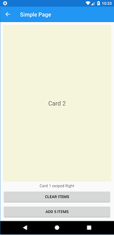
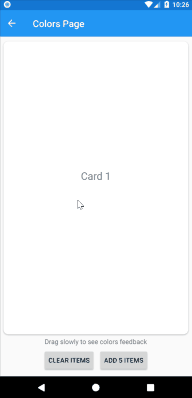
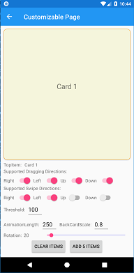

# SwipeCardView Control for Xamarin.Forms

[](https://www.nuget.org/packages/MLToolkit.Forms.SwipeCardView/)

SwipeCardView is a lightweight MVVM friendly UI control that brings Tinder-style swipeable cards into Xamarin.Forms applications. It supports swiping in all directions while providing constant dragging feedback, which enables awesome interactivity.

This netstandard2.0 library is intended for anyone who wants to build swipeable UI in C#. As it's built on top of Xamarin.Forms, it works on Android, iOS and any other supported platform. If you are familiar with Xamarin.Forms ListView and SwipeGestureRecognizer interfaces, you will be able to utilize SwipeCardView with minimal effort. It's highly customizable too, by giving you options to set supported directions, back card scale, rotation angle etc.


## Setup

- Available on NuGet: [MLToolkit.Forms.SwipeCardView](https://www.nuget.org/packages/MLToolkit.Forms.SwipeCardView/)
- Install into your PCL/.NET Standard project

## Features

- Data Source – Populate a SwipeCardView with data using ItemSource, with or without data binding
- Card Appearance – Customize the appearance of the cards using ItemTemplate
- Adjustability – Customize the behavior of SwipeCardView. Set card rotation, animation length, back card scale etc.
- Interactivity – Respond to dragging and swipe gestures using events or commands

For more info about the features check out [the full documentation](docs/index.md).

## API

[SwipeCardView API](docs/api.md)

## Changelog

[Change Log - November 2018](docs/changelog.md)

## Samples

You can try all the samples by cloning this project and running the solution in Visual Studio.

### Simple Page

The intention of this sample is to show how simple it is to start using SwipeCardView in your MVVM app. All you need is a collection of items and a command handler.



```XML
<swipeCardView:SwipeCardView
    ItemsSource="{Binding CardItems}"
    SwipedCommand="{Binding SwipedCommand}"
    VerticalOptions="FillAndExpand">
    <swipeCardView:SwipeCardView.ItemTemplate>
        <DataTemplate>
            <Label Text="{Binding .}" FontSize="Large" HorizontalTextAlignment="Center" VerticalTextAlignment="Center" BackgroundColor="Beige"/>
        </DataTemplate>
    </swipeCardView:SwipeCardView.ItemTemplate>
</swipeCardView:SwipeCardView>
```

- Data source is CardItems, a list of strings defined in the bound ViewModel
- Card appearance is defined by a simple DataTemplate, which contains only a Label
- Various SwipeCardView properties are not being set, so the control is using default values
- SwipedCommand will be triggered when the card is swiped over threshold in any direction

### Colors Page

The intention of this sample is to demonstrate the SwipeCardView interactivity. Each color represents one DraggingCardPosition. Labels on cards represent the current values of SwipeCardDirection and DraggingCardPosition.



- Data source is CardItems, a list of strings defined in the bound ViewModel
- Card appearance is defined by a simple DataTemplate. DirectionLabel, PositionLabel and background color will be updated from code behind
- Various SwipeCardView properties are not being set, so the control is using default values
- SwipedCommand will be triggered when the card is swiped over threshold in any direction. Dragging event is being triggered while dragging gesture is being performed, which updates the card appearance

### Tinder Page

The intention of this sample is to replicate Tinder UI.


- Data source is Profiles, an ObservableCollection of Profiles defined in the bound ViewModel
- Card appearance is defined as a Frame with AbsoluteLayout containing all the necessary layers. Opacity LikeFrame, NopeFrame and SuperLikeFrame are updated on Dragging event
- Various SwipeCardView properties are not being set, so the control is using default values
- SwipedCommand will be triggered when the card is swiped over threshold. Dragging event is triggered while dragging gesture is being performed which updates the card appearance, as well as the scale of the control buttons
- Just like in Tinder UI, all 4 dragging directions are supported, but swipe gesture is recognized only on Right, Left and Up

### Customizable Page

The intention of this page is to demonstrate the use of all the properties of SwipeCardView. All properties can be updated in runtime using the UI controls below:



## Migration From SwipeCardView 1.x

The migration should be fairly simple:

- A breaking change is introducing SwipedCommand that takes SwipedCardEventArgs instead of SwipedLeftCommand and SwipedRightCommand. Make sure to replace those 2 handlers with the new one
- Updating card background on dragging is removed in favor of Dragging command/event. If needed, the old behavior could be easily reproduced by utilizing Dragging event. Check ColorsPage for the implementation details.
- Read [the full documentation](docs/index.md) to get yourself familiar with the new features

## Other remarks

- While developing SwipeCardView 2.0 I tried to follow [.NET standard library guidance](https://docs.microsoft.com/en-us/dotnet/standard/library-guidance/)
- This library has nothing to do with Machine Learning. MLToolkit is just an unique prefix