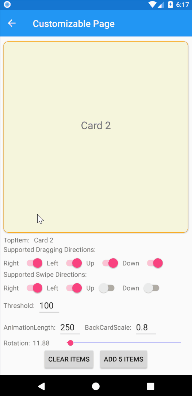
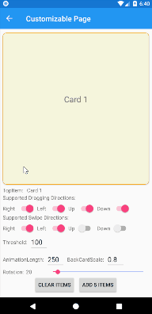
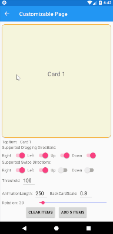

# SwipeCardView

SwipeCardView is a view for presenting lists of data in cards that could be dragged and swiped off of the screen. This guide will show you how to use SwipeCardView:

1. **[Data Source](#Data-Source)** &ndash; Populate a SwipeCardView with data using ItemSource
2. **[Card Appearance](#Card-Appearance)** &ndash; Customize the appearance of the cards using ItemTemplate
3. **[Adjustability](#adjustability)** &ndash; Customize the behavior of SwipeCardView. Set card rotation, animation length, back card scale etc.
4. **[Interactivity](#interactivity)** &ndash; Respond to dragging and swipe gestures using events or commands

## Data Source

### ItemsSource

A SwipeCardView is populated with data using the ItemsSource property, which can accept any collection implementing `IEnumerable`. The simplest way to populate a `SwipeCardView` involves using an array of strings:

```xaml
<swipeCardView:SwipeCardView 
    VerticalOptions="FillAndExpand">
    <swipeCardView:SwipeCardView.ItemTemplate>
        <DataTemplate>
            <Label Text="{Binding .}" FontSize="Large" HorizontalTextAlignment="Center" VerticalTextAlignment="Center" BackgroundColor="Beige"/>
        </DataTemplate>
    </swipeCardView:SwipeCardView.ItemTemplate>
    <swipeCardView:SwipeCardView.ItemsSource>
        <x:Array Type="{x:Type x:String}">
            <x:String>Card 1</x:String>
            <x:String>Card 2</x:String>
            <x:String>Card 3</x:String>
        </x:Array>
    </swipeCardView:SwipeCardView.ItemsSource>
</swipeCardView:SwipeCardView>
```

### Data Binding

Data binding is the "glue" that binds the properties of a user interface object to the properties of some CLR object, such as a class in your ViewModel. Data binding works by keeping objects in sync as their bound values change.

Define ObservableCollection in the ViewModel:

```csharp
private ObservableCollection<string> _cardItems = new ObservableCollection<string>();

public ObservableCollection<string> CardItems
{
    get => _cardItems;
    set
    {
        _cardItems = value;
        this.RaisePropertyChanged();
    }
}
```

Bind it to ItemSource in the Page:

```xaml
<swipeCardView:SwipeCardView
    ItemsSource="{Binding CardItems}">
    <swipeCardView:SwipeCardView.ItemTemplate>
        <DataTemplate>
            <Label Text="{Binding .}" />
        </DataTemplate>
    </swipeCardView:SwipeCardView.ItemTemplate>
</swipeCardView:SwipeCardView>
```

Data binding in SwipeCardView works the same way as in ListView. For in depth article on the topic check [ListView Data Sources](https://docs.microsoft.com/en-us/xamarin/xamarin-forms/user-interface/listview/data-and-databinding).

### Binding TopItem

Often you'll want to bind to the top item of a `SwipeCardView`, rather than use an event handler to respond to changes. To do this in XAML, bind the `TopItem` property:

```xaml
<swipeCardView:SwipeCardView
    ItemsSource="{Binding CardItems}"
    TopItem="{Binding TopItem}">
    <swipeCardView:SwipeCardView.ItemTemplate>
        <DataTemplate>
            <Label Text="{Binding .}" />
        </DataTemplate>
    </swipeCardView:SwipeCardView.ItemTemplate>
</swipeCardView:SwipeCardView>
```

```csharp
private string _topItem;

public string TopItem
{
    get => _topItem;
    set
    {
        _topItem = value;
        RaisePropertyChanged();
    }
}
```

Assuming `SwipeCardView`'s `ItemsSource` is a list of strings, `TopItem` property of the ViewModel will be OneWayToSource bound to the string on top of the stack. Keep in mind that this property is intended to be used for getting the top item value only, as setting it from a ViewModel doesn't make much sense.

## Card Appearance

SwipeCardView has ItemTemplate property which can receive any kind of DataTemplate. This means that your card could be made of just one label, or could be made of complex layered layout like Tinder has.

It is up to you and your imagination to decide how the card will look like, but always keep in mind performance. While dragging the card around the screen, it has to be rendered many times, so keeping it simple may be the best way to provide the optimal performance.

[Creating a Xamarin.Forms DataTemplate](https://docs.microsoft.com/en-us/xamarin/xamarin-forms/app-fundamentals/templates/data-templates/creating)

[Customizing ListView Cell Appearance](https://docs.microsoft.com/en-us/xamarin/xamarin-forms/user-interface/listview/customizing-cell-appearance)

## Adjustability

SwipeCardView has a number of properties that you could use to adjust its appearance.

### AnimationLength

The duration in milliseconds of the animation that occurs at the end of dragging movement. If the card was dragged over threshold and swipe is supported for that direction, the card would be animated out of the screen. If not, the card would be brought back to the starting position.

Below is an example of dragging over and under threshold with animation length set to 250 and 1000 milliseconds:



### BackCardScale

The value represents the scale of the back card at the beginning of the dragging movement. While the front card is being dragged closer to the threshold, the back card is being scaled up. It reaches value of 1 when the front card reaches the threshold.

Difference between BackCardScale being 0.8 and 0.5:



### CardRotation

Rotation adjuster in degrees for dragging to left or right. Zero value means no rotation, while 360 means that the card will make a full circle.



## Interactivity

### Swiped event/command

If you are familiar with [SwipeGestureRecognizer](https://docs.microsoft.com/en-us/xamarin/xamarin-forms/app-fundamentals/gestures/swipe), introduced in Xamarin.Forms 3.2, you already know how Swiped event/command works.

A swipe gesture occurs when a finger is moved across the screen in a horizontal or vertical direction, and is often used to initiate navigation through content.

### Responding to the swipe

An event handler for the Swiped event is shown in the following example:

```csharp
void OnSwiped(object sender, SwipedCardEventArgs e)
{
    switch (e.Direction)
    {
        case SwipeCardDirection.None:
            break;
        case SwipeCardDirection.Right:
            break;
        case SwipeCardDirection.Left:
            break;
        case SwipeCardDirection.Up:
            break;
        case SwipeCardDirection.Down:
            break;
    }
}
```

The SwipedCardEventArgs can be examined to determine the direction of the swipe, with custom logic responding to the swipe as required. The direction of the swipe can be obtained from the Direction property of the event arguments, which will be set to one of the values of the SwipeCardDirection enumeration. In addition, the event arguments also have a Parameter property that will be set to the value of the CommandParameter property, if defined. The item that the card is bound to can be obtained from the Item property.

### Dragging event/command

SwipeGestureRecognizer is a great feature if you just want to recognize swipe gesture. But people usually want visual feedback while performing the swipe movement. That's where Dragging event/command kicks in.

### Responding to the dragging

From the beginning of the movement until the end, SwipeCardView will be triggering Dragging events constantly.

```csharp
private void OnDragging(object sender, DraggingCardEventArgs e)
{
    switch (e.Position)
    {
        case DraggingCardPosition.Start:
            break;
        case DraggingCardPosition.UnderThreshold:
            break;
        case DraggingCardPosition.OverThreshold:
            break;
        case DraggingCardPosition.FinishedUnderThreshold:
            break;
        case DraggingCardPosition.FinishedOverThreshold:
            break;
    }
}
```

The DraggingCardEventArgs can be examined to determine the position of the card, with custom logic that updates UI elements as required. 
The position of the card can be obtained from the Position property of the event arguments, which will be set to one of the values of the DraggingCardPosition enumeration. The direction of the swipe can be obtained from the Direction property of the event arguments, which will be set to one of the values of the SwipeCardDirection enumeration. In addition, the event arguments also have a Parameter property that will be set to the value of the CommandParameter property, if defined. The item that the card is bound to can be obtained from the Item
property. At last, there are DistanceDraggedX and DistanceDraggedY properties.

### Limitations

SwipeCardView is build utilizing PanGestureRecognizer. Xamarin.Forms does not support propagation of touch events. That being said, you probably don't want to add other gesture recognizer to you card's ItemTemplate, because only one gesture recognizer will be receiving the events.

If you add button to your ItemTemplate, that button will be receiving click events regularly, but you will not be able to initiate the dragging movement from within the button area.